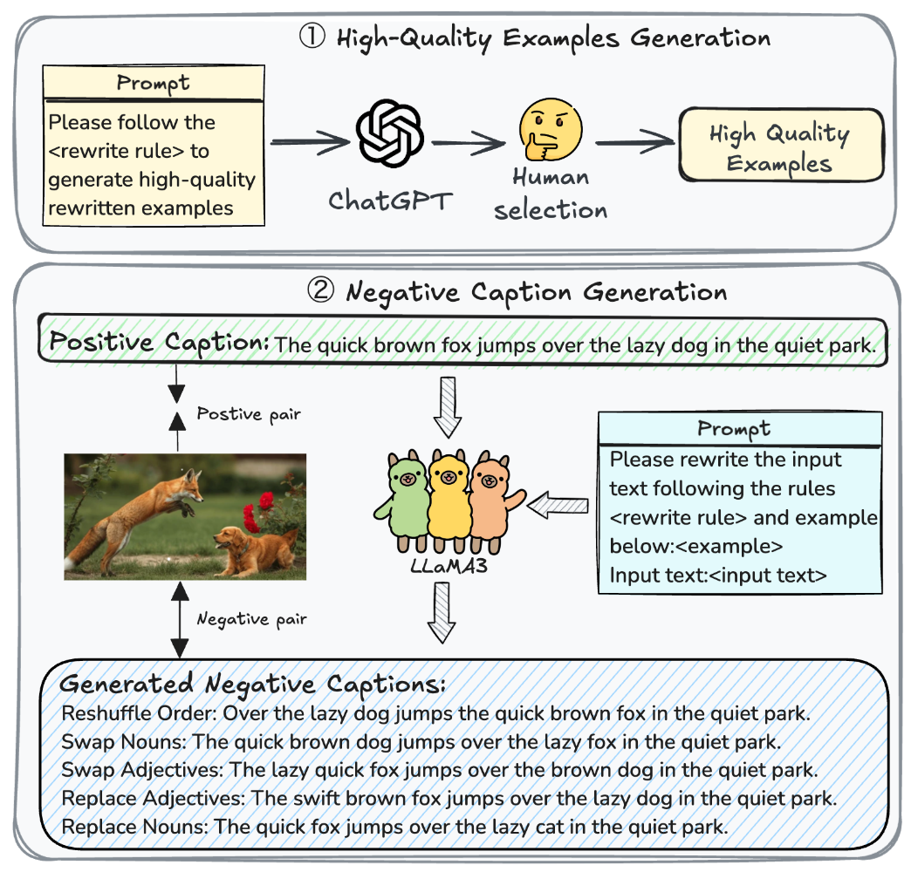

# Official Pytorch implementation of [Decoupled Global-Local Alignment for Improving Compositional Understanding]


> **[Decoupled Global-Local Alignment for Improving
Compositional Understanding](xx)** <br>
<a href="https://scholar.google.com.hk/citations?user=zBM8_XkAAAAJ&hl=zh-CN&oi=ao">Xiaoxing Hu</a>,</span>
<a href="https://kaicheng-yang0828.github.io">Kaicheng Yang</a>,</span>
Jun Wang,</span>
Haoran Xu,</span>
Ziyong Feng,</span>
<a href="https://scholar.google.com.hk/citations?user=3nMDEBYAAAAJ&hl=zh-CN&oi=ao">Yupei Wang</a></span>
## 📣 News

- [2025/04/xx]:✨The training code and pertrained weight of DeGLA have been released.
- [2025/04/xx]:✨The paper of [DeGLA](xx) is submitted to arXiv.
## 💡 Highlights
We propose a simple yet effective negative caption generation pipeline that harnesses the in-context learning capability of Large Language Models (LLMs) to produce high-quality negative captions, facilitating hard negative-based fine-tuning



We introduce the DeGLA framework, which employs a self-
distillation mechanism within the global alignment to maintain
the model’s inherent general comprehension capabilities. Addi-
tionally, it combines Image-Grounded Contrast (IGC) loss and
Text-Grounded Contrast (TGC) loss to improve vision-language
compositional understanding


## 🎨 TODO
- [ ] Release training code
- [ ] Release model weight
- [ ] Release training data

## Environment installation
Our work is based on [openclip](https://github.com/mlfoundations/open_clip),[NegCLIP](https://github.com/vinid/neg_clip), [CE-CLIP](https://github.com/lezhang7/Enhance-FineGrained), you can refer to these repository for environment setup, then modify them according to our code and proceed with the train. Alternatively, you can refer to the environment detailed below:
```base
conda create -n DeGLA python=3.9 -y
conda activate DeGLA
pip install -r requirements.txt
```
Our CUDA version is 12.1. You can adjust the versions of the relevant libraries, such as PyTorch, according to your CUDA version.

## Training
Our hard negative data is released at [Baidu Yun](),[GoogleDrive]() and [Huggingface]().
```bash
git clone https://github.com/xiaoxing2001/DeGLA
cd DeGLA
./scripts/train_DeGLA.sh
```
## Evaluation
Our weights is released at [Baidu Yun](),[GoogleDrive]() and [Huggingface]().
 Our compositional reansoning evaluation is based on other repositories. For ARO, please visit [ARO](https://github.com/mertyg/vision-language-models-are-bows). For SugarCrepe, please visit [SugarCrepe](https://github.com/RAIVNLab/sugar-crepe). For VALSE, please visit [VALSE](https://github.com/Heidelberg-NLP/VALSE).
## Results
- ### VALSE

- ### SugarCrepe

- ### ARO

- ### Zero-shot image classification


## Acknowledgements
This project is based on [CE-CLIP](https://github.com/lezhang7/Enhance-FineGrained),[NegCLIP](https://github.com/vinid/neg_clip),[openclip](https://github.com/mlfoundations/open_clip), thanks for their works.

## License

This project is released under the MIT license. Please see the [LICENSE](LICENSE) file for more information.

## 📖 Citation
If you find this repository useful, please use the following BibTeX entry for citation.
```latex
arxiv_link
```

<!-- ## 🌟Star History

[](https://star-history.com/#deepglint/RWKV-CLIP&Date) -->